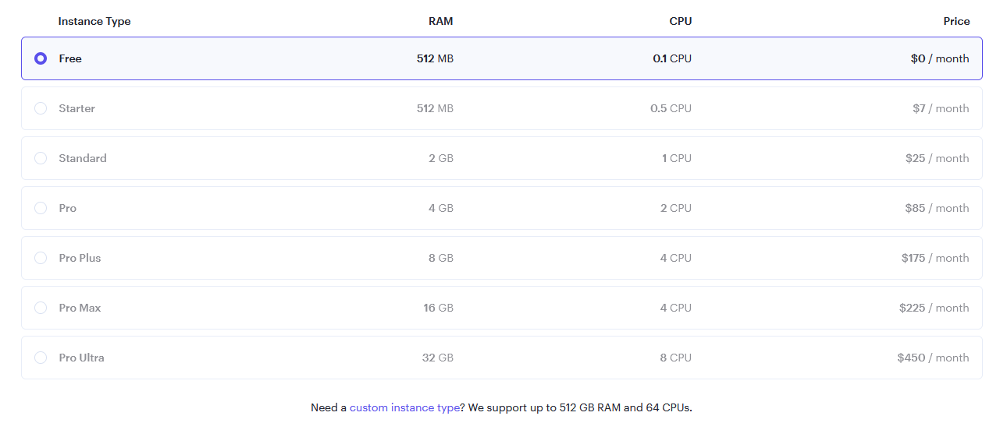
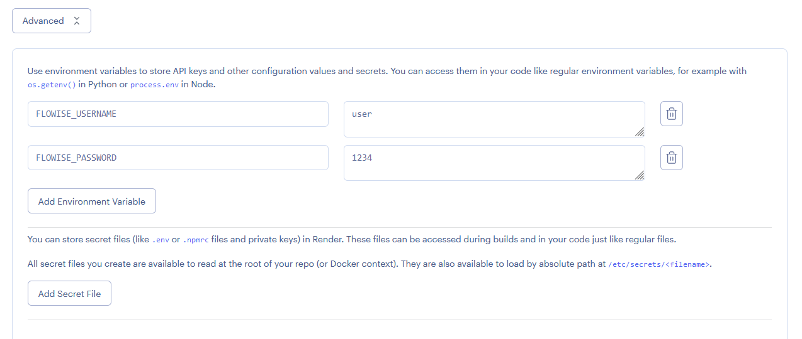
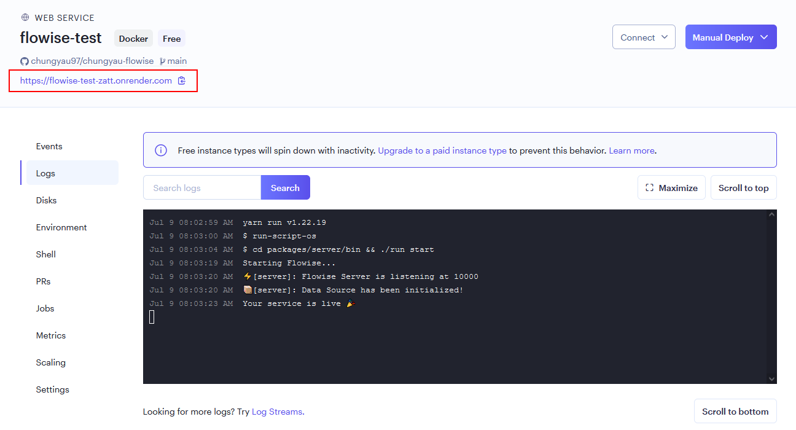
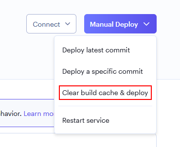

# Render

***

1. Fork [SamaFlow Official Repository](https://github.com/SamaFlow/SamaFlow)
2. Visit your github profile to assure you have successfully made a fork
3. Sign in to [Render](https://dashboard.render.com)
4. Click **New +**

<figure><figcaption></figcaption></figure>

5. Select **Web Service**

<figure><figcaption></figcaption></figure>

6. Connect Your GitHub Account
7. Select your forked SamaFlow repo and click **Connect**

<figure><figcaption></figcaption></figure>

8. Fill in your preferred **Name** and **Region.**
9. Select `Docker` as your **Runtime**

<figure><figcaption></figcaption></figure>

9. Select an **Instance**

<figure><figcaption></figcaption></figure>

10. _(Optional)_ Add app level authorization, click **Advanced** and add `Environment Variable`

* FLOWISE\_USERNAME
* FLOWISE\_PASSWORD

<figure><figcaption></figcaption></figure>

Add `NODE_VERSION` with value `18.18.1` as the node version to run the instance.

There are list of env variables you can configure. Refer to [environment-variables.md](../environment-variables.md "mention")

11. Click **Create Web Service**

<figure><figcaption></figcaption></figure>

12. Navigate to the deployed URL and that's it [🚀](https://emojipedia.org/rocket/)[🚀](https://emojipedia.org/rocket/)

<figure><figcaption></figcaption></figure>

## Persistent Disk

The default filesystem for services running on Render is ephemeral. SamaFlow data isn’t persisted across deploys and restarts. To solve this issue, we can use [Render Disk](https://render.com/docs/disks).

1. On the left hand side bar, click **Disks**
2. Name your disk, and specify the **Mount Path** to `/opt/render/.samaflow`

<figure><figcaption></figcaption></figure>

3. Click the **Environment** section, and add these new environment variables:

* HOST - `0.0.0.0`
* DATABASE\_PATH - `/opt/render/.samaflow`
* APIKEY\_PATH - `/opt/render/.samaflow`
* LOG\_PATH - `/opt/render/.samaflow/logs`
* SECRETKEY\_PATH - `/opt/render/.samaflow`
* BLOB\_STORAGE\_PATH - `/opt/render/.samaflow/storage`

<figure><figcaption></figcaption></figure>

4. Click **Manual Deploy** then select **Clear build cache & deploy**

<figure><figcaption></figcaption></figure>

5. Now try creating a flow and save it in SamaFlow. Then try restarting service or redeploy, you should still be able to see the flow you have saved previously.

Watch how to deploy to Render




