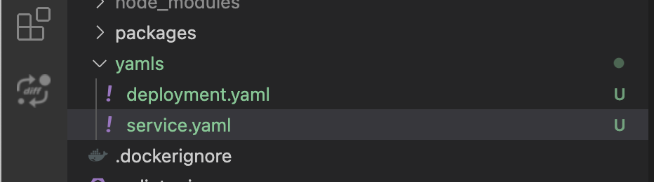

# GCP

## Prerrequisitos

1. Instala [Google Cloud CLI](https://cloud.google.com/sdk/docs/install)
2. Instala [kubectl](https://kubernetes.io/docs/tasks/tools/)

## Configuración de GCP

1. Crea un nuevo proyecto en GCP
2. Habilita las siguientes APIs:
   * Kubernetes Engine API
   * Container Registry API
3. Crea un cluster de Kubernetes en GKE
4. Configura kubectl para usar el cluster de GKE:

```bash
gcloud container clusters get-credentials [ClusterName] --zone [DataCenter] --project [ProjectId]
```

5. Verifica que kubectl esté usando el contexto correcto:

```bash
kubectl config use-context gke_[ProjectId]_[DataCenter]_[ClusterName]
```

## Build y Push de la Imagen Docker

Ejecuta los siguientes comandos para hacer build y push de la imagen Docker al Container Registry de GCP.

1. Clona SamaFlow

```bash
git clone https://github.com/SamaFlow/SamaFlow.git
```

2. Haz build de SamaFlow

```bash
cd SamaFlow
pnpm install
pnpm build
```

3. Actualiza el archivo `Dockerfile` un poco.

> Especifica la plataforma de nodejs
>
> ```dockerfile
> FROM --platform=linux/amd64 node:18-alpine
> ```
>
> Agrega python3, make y g++ a la instalación
>
> ```dockerfile
> RUN apk add --no-cache python3 make g++
> ```

3. Haz build como imagen Docker, asegúrate de que la app de Docker desktop esté corriendo

```bash
docker build -t gcr.io/[ProjectId]/samaflow:dev .
```

4. Haz push de la imagen Docker al container registry de GCP.

```bash
docker push gcr.io/[ProjectId]/samaflow:dev
```

## Deployment en GCP

1. Crea una carpeta raíz `yamls` en el proyecto.
2. Agrega el archivo `deployment.yaml` en esa carpeta.

```yaml
# deployment.yaml
apiVersion: apps/v1
kind: Deployment
metadata:
  name: samaflow
  labels:
    app: samaflow
spec:
  selector:
    matchLabels:
      app: samaflow
  replicas: 1
  template:
    metadata:
      labels:
        app: samaflow
    spec:
      containers:
      - name: samaflow
        image: gcr.io/[ProjectID]/samaflow:dev
        imagePullPolicy: Always
        resources: 
          requests:
            cpu: "1"
            memory: "1Gi"
```

3. Agrega el archivo `service.yaml` en esa carpeta.

```yaml
# service.yaml
apiVersion: "v1"
kind: "Service"
metadata:
  name: "samaflow-service"
  namespace: "default"
  labels:
    app: "samaflow"
spec:
  ports:
  - protocol: "TCP"
    port: 80
    targetPort: 3000
  selector:
    app: "samaflow"
  type: "LoadBalancer"
```

Se verá como abajo.

<figure><figcaption></figcaption></figure>

4. Haz deploy de los archivos yaml ejecutando los siguientes comandos.

```bash
kubectl apply -f yamls/deployment.yaml
kubectl apply -f yamls/service.yaml
```

5. Ve a `Workloads` en GCP, podrás ver que tu pod está corriendo.

<figure><figcaption></figcaption></figure>

6. Ve a `Services & Ingress`, podrás hacer clic en `Endpoint` donde se hospeda SamaFlow.

<figure><figcaption></figcaption></figure>

## Congratulations!

You have successfully hosted the SamaFlow apps on GCP [🥳](https://emojipedia.org/partying-face/)

## Timeout

By default, there is a 30 seconds timeout assigned to the proxy by GCP. This caused issue when the response is taking longer than 30 seconds threshold to return. In order to fix this issue, make the following changes to YAML files:

Note: To set the timeout to be 10 minutes (for example) -- we specify 600 seconds below.

1. Create a `backendconfig.yaml` file with the following content:

```yaml
apiVersion: cloud.google.com/v1
kind: BackendConfig
metadata:
  name: samaflow-backendconfig
  namespace: your-namespace
spec:
  timeoutSec: 600
```

2. Issue: `kubectl apply -f backendconfig.yaml`
3. Update your `service.yaml` file with the following reference to the `BackendConfig`:

```yaml
apiVersion: v1
kind: Service
metadata:
  annotations:
    cloud.google.com/backend-config: '{"default": "samaflow-backendconfig"}'
  name: samaflow-service
  namespace: your-namespace
...
```

4. Issue: `kubectl apply -f service.yaml`
