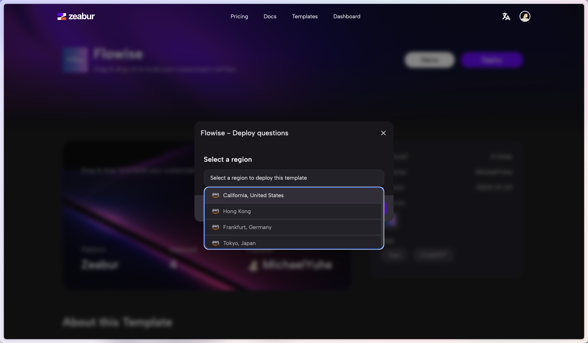

# Zeabur

## Deploy usando Zeabur

1. Haz click en el botón de abajo para hacer deploy de SamaFlow en Zeabur

2. Haz click en **Deploy**

<figure><figcaption></figcaption></figure>

3. Selecciona **Configure**

<figure><figcaption></figcaption></figure>

4. Haz click en **Deploy**

<figure><figcaption></figcaption></figure>

5. Espera a que el deployment se complete

<figure><figcaption></figcaption></figure>

6. Hay una lista de environment variables que puedes configurar. Consulta [environment-variables.md](../environment-variables.md "mention")

¡Eso es todo! Ahora tienes SamaFlow desplegado en Zeabur [🎉](https://emojipedia.org/party-popper/)[🎉](https://emojipedia.org/party-popper/)

## Persistent Volume

Zeabur creará automáticamente un persistent volume para ti, así que no tienes que preocuparte por eso.
