# Zapier Zaps

***

## Prerequisitos

1. [Inicia sesión](https://zapier.com/app/login) o [regístrate](https://zapier.com/sign-up) en Zapier
2. Consulta [deployment](../../configuration/deployment/) para crear una versión alojada en la nube de SamaFlow.

## Configuración

1. Ve a [Zapier Zaps](https://zapier.com/app/zaps)
2. Haz clic en **Create**

<figure><figcaption></figcaption></figure>

### Recibir Mensaje Trigger

1.  Haz clic o busca **Discord**

    <figure><figcaption></figcaption></figure>
2.  Selecciona **New Message Posted to Channel** como Event y haz clic en **Continue**

    <figure><figcaption></figcaption></figure>
3.  **Inicia sesión** en tu cuenta de Discord

    <figure><figcaption></figcaption></figure>
4.  Añade **Zapier Bot** a tu servidor preferido

    <figure>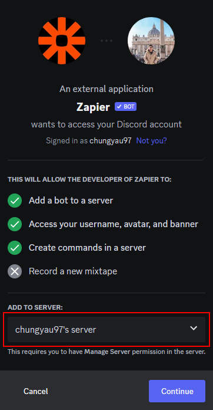<figcaption></figcaption></figure>
5.  Otorga los permisos apropiados y haz clic en **Authorize**, luego haz clic en **Continue**

    <figure>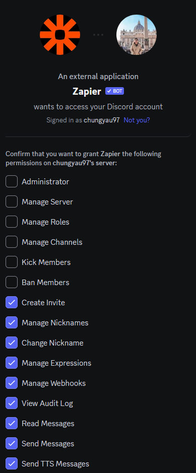<figcaption></figcaption></figure>

    <figure>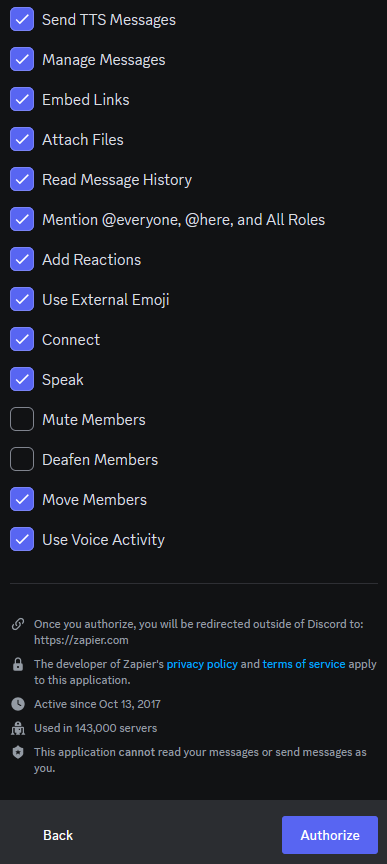<figcaption></figcaption></figure>
6.  Selecciona tu **canal preferido** para interactuar con Zapier Bot y haz clic en **Continue**

    <figure>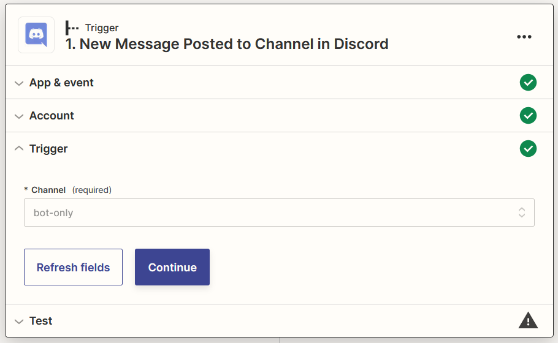<figcaption></figcaption></figure>
7.  **Envía un mensaje** a tu canal seleccionado en el paso 8

    <figure>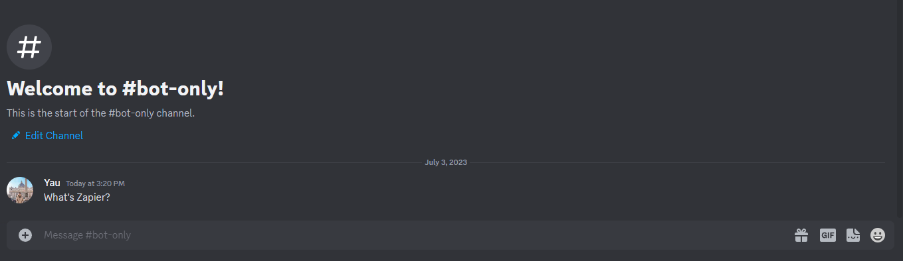<figcaption></figcaption></figure>
8.  Haz clic en **Test trigger**

    <figure><figcaption></figcaption></figure>
9.  Selecciona tu mensaje y haz clic en **Continue with the selected record**

    <figure><figcaption></figcaption></figure>

### Filtrar Mensajes del Zapier Bot

1.  Haz clic o busca **Filter**

    <figure>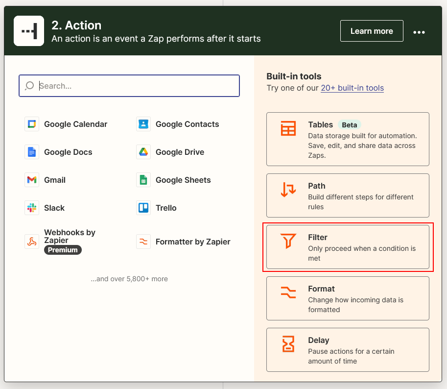<figcaption></figcaption></figure>
2.  Configura el **Filter** para no continuar si se recibe un mensaje del **Zapier Bot** y haz clic en **Continue**

    <figure>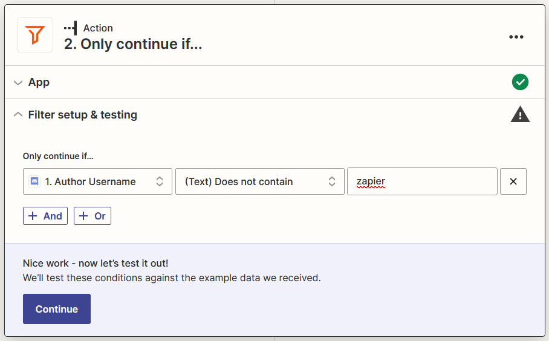<figcaption></figcaption></figure>

### SamaFlow genera Mensaje de Resultado

1.  Haz clic en **+**, haz clic o busca **SamaFlow**

    <figure>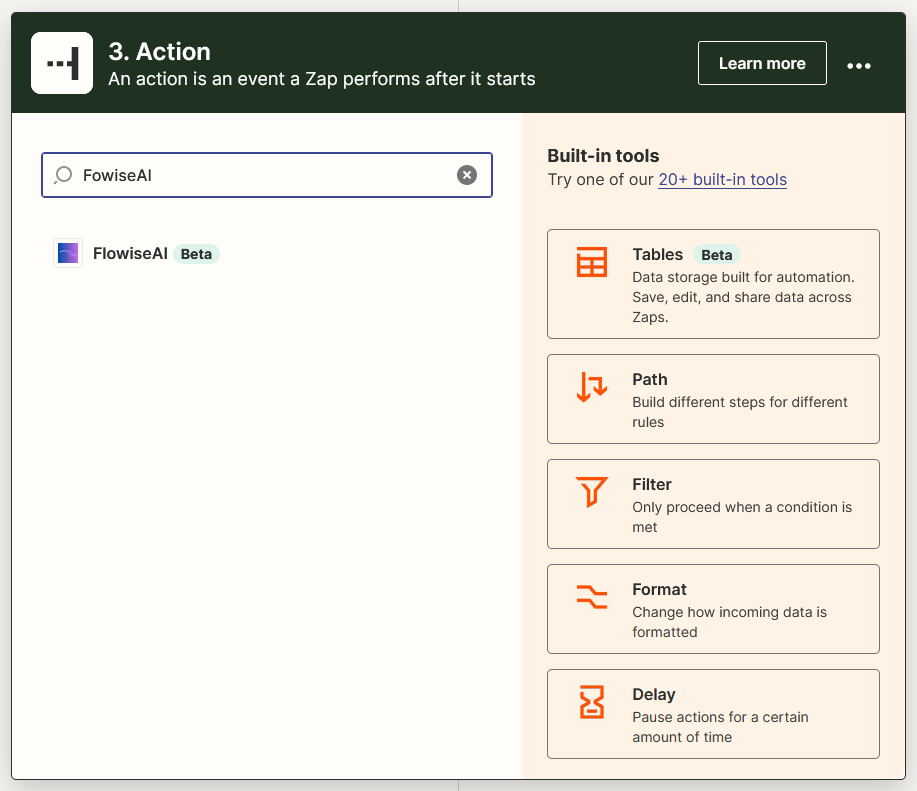<figcaption></figcaption></figure>
2.  Selecciona **Make Prediction** como Event y haz clic en **Continue**

    <figure>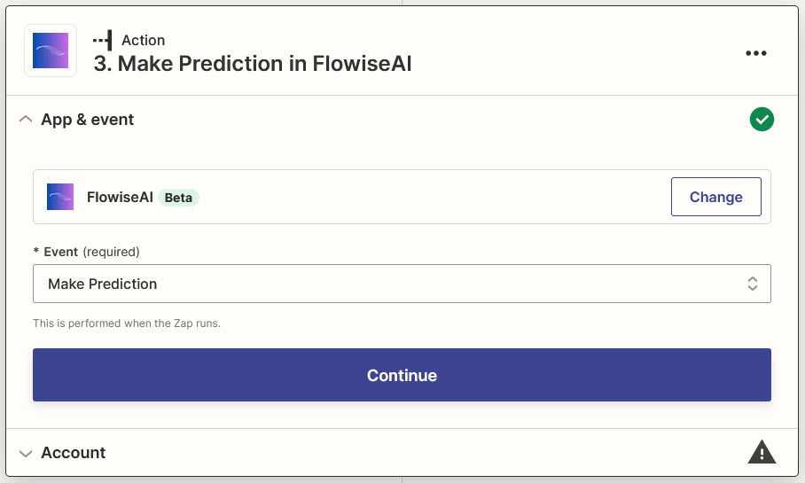<figcaption></figcaption></figure>
3.  Haz clic en **Sign in** e inserta tus datos, luego haz clic en **Yes, Continue to SamaFlow**

    <figure>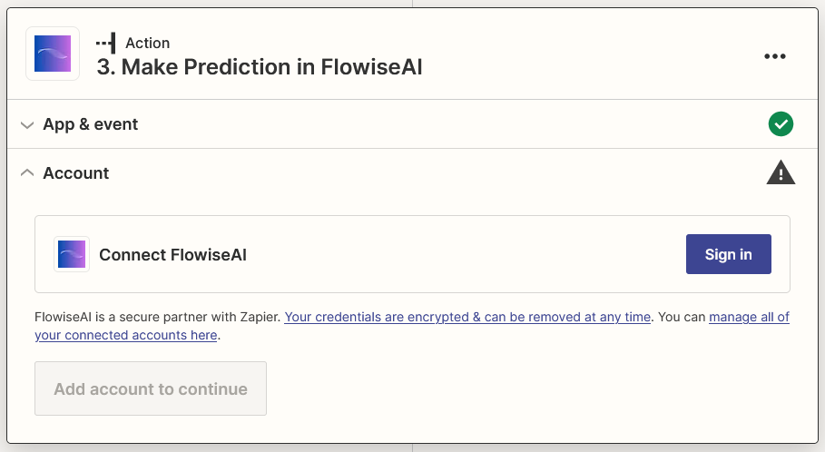<figcaption></figcaption></figure>

    <figure>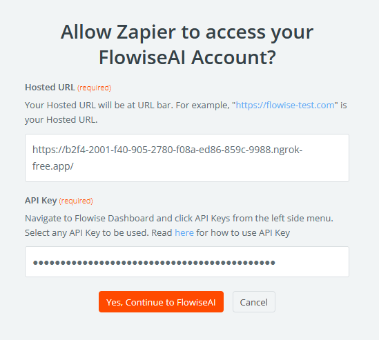<figcaption></figcaption></figure>
4.  Selecciona **Content** de Discord y tu Flow ID, luego haz clic en **Continue**

    <figure><figcaption></figcaption></figure>
5.  Haz clic en **Test action** y espera tu resultado

    <figure>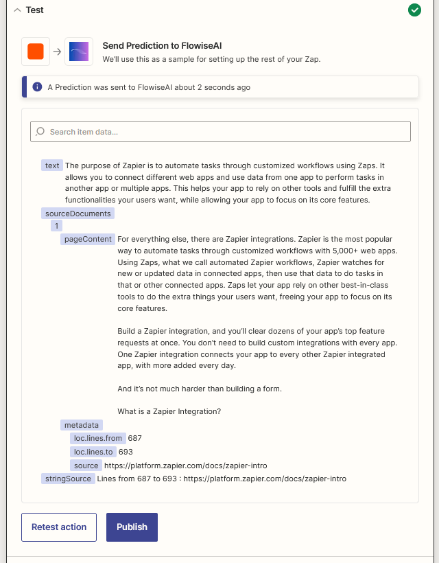<figcaption></figcaption></figure>

### Enviar Mensaje de Resultado

1.  Haz clic en **+**, haz clic o busca **Discord**

    <figure><figcaption></figcaption></figure>
2.  Selecciona **Send Channel Message** como Event y haz clic en **Continue**

    <figure>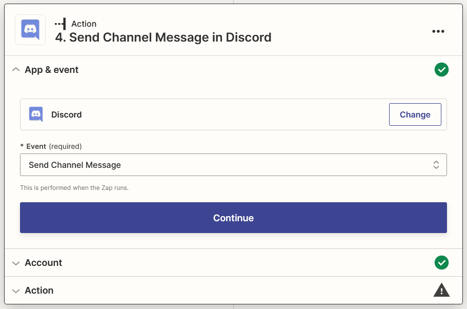<figcaption></figcaption></figure>
3.  Selecciona la cuenta de Discord en la que iniciaste sesión y haz clic en **Continue**

    <figure><figcaption></figcaption></figure>
4.  Selecciona tu Canal preferido para channel y selecciona **Text** y **String Source** (si está disponible) de SamaFlow para Message Text, luego haz clic en **Continue**

    <figure>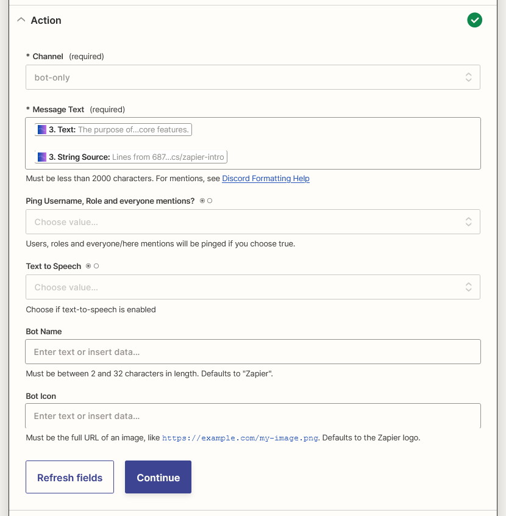<figcaption></figcaption></figure>
5.  Haz clic en **Test action**

    <figure>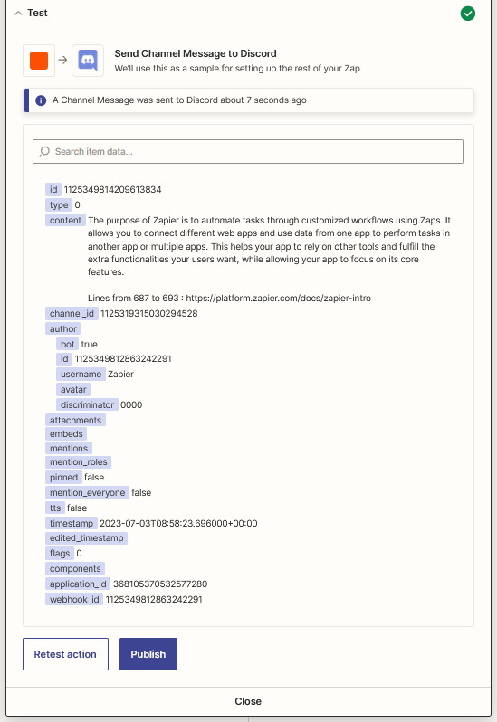<figcaption></figcaption></figure>
6.  ¡Listo! [🎉](https://emojipedia.org/party-popper/) Deberías ver el mensaje en tu Canal de Discord

    <figure><figcaption></figcaption></figure>
7.  Por último, renombra tu Zap y publícalo

    <figure><figcaption></figcaption></figure>
