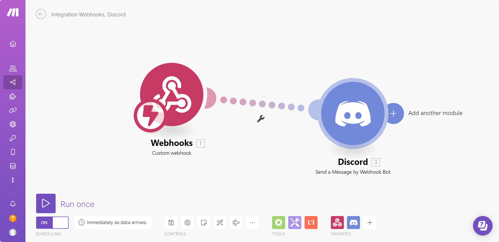
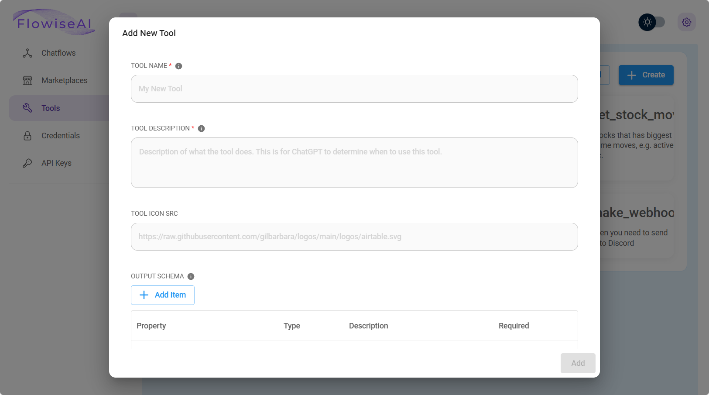
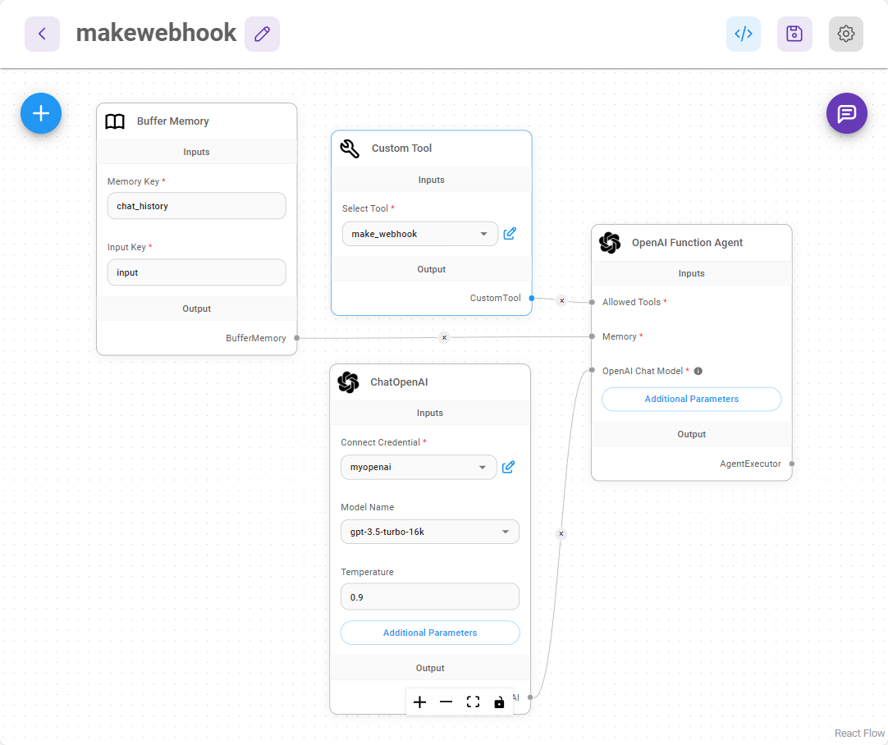

# Llamando a Webhook

***

En este tutorial de caso de uso, vamos a crear una herramienta personalizada que podrá llamar a un endpoint webhook y pasar los parámetros necesarios en el cuerpo del webhook. Usaremos [Make.com](https://www.make.com/en) para crear el flujo de trabajo webhook.

## Make

Dirígete a Make.com, después de registrar una cuenta, crea un flujo de trabajo que tenga un módulo Webhook y un módulo Discord, que se vea como abajo:

<figure><figcaption></figcaption></figure>

Desde el módulo Webhook, deberías poder ver una URL webhook:

<figure><figcaption></figcaption></figure>

Desde el módulo Discord, estamos pasando el cuerpo `message` del Webhook como el mensaje para enviar al canal de Discord:

<figure><figcaption></figcaption></figure>

Para probarlo, puedes hacer clic en Run once en la esquina inferior izquierda y enviar una solicitud POST con un cuerpo JSON

```json
{
    "message": "Hello Discord!"
}
```

<figure><figcaption></figcaption></figure>

Podrás ver un mensaje de Discord enviado al canal:

<figure><figcaption></figcaption></figure>

¡Perfecto! Hemos configurado exitosamente un flujo de trabajo que puede pasar un mensaje y enviarlo al canal de Discord [🎉 ](https://emojiterra.com/party-popper/)[🎉](https://emojiterra.com/party-popper/)

## SamaFlow

En SamaFlow, vamos a crear una herramienta personalizada que pueda hacer la solicitud POST al Webhook, con el cuerpo del mensaje.

Desde el dashboard, haz clic en **Tools**, luego haz clic en **Create**

<figure><figcaption></figcaption></figure>

Luego podemos llenar los siguientes campos (siéntete libre de cambiarlos según tus necesidades):

* **Tool Name**: make\_webhook (debe estar en snake\_case)
* **Tool Description**: Útil cuando necesitas enviar mensajes a Discord
* **Tool Icon Src**: [https://github.com/SamaFlow/SamaFlow/assets/26460777/517fdab2-8a6e-4781-b3c8-fb92cc78aa0b](https://github.com/SamaFlow/SamaFlow/assets/26460777/517fdab2-8a6e-4781-b3c8-fb92cc78aa0b)
* **Input Schema**:

<figure><figcaption></figcaption></figure>

* **JavaScript Function**:

```javascript
const fetch = require('node-fetch');
const webhookUrl = 'https://hook.eu1.make.com/abcdef';
const body = {
	"message": $message
};
const options = {
    method: 'POST',
    headers: {
        'Content-Type': 'application/json'
    },
    body: JSON.stringify(body)
};
try {
    const response = await fetch(webhookUrl, options);
    const text = await response.text();
    return text;
} catch (error) {
    console.error(error);
    return '';
}
```

Haz clic en **Add** para guardar la herramienta personalizada, y ahora deberías poder verla:

<figure><figcaption></figcaption></figure>

Ahora, crea un nuevo canvas con los siguientes nodos:

* **Buffer Memory**
* **ChatOpenAI**
* **Custom Tool** (selecciona la herramienta make\_webhook que acabamos de crear)
* **OpenAI Function Agent**

Debería verse como abajo después de conectarlos:

<figure><figcaption></figcaption></figure>

¡Guarda el chatflow y comienza a probarlo!

Por ejemplo, podemos hacer preguntas como _"cómo cocinar un huevo"_

<figure><figcaption></figcaption></figure>

Luego pide al agente que envíe todo esto a Discord:

<figure><figcaption></figcaption></figure>

Ve al canal de Discord, y podrás ver el mensaje:

<figure><figcaption></figcaption></figure>

¡Eso es todo! OpenAI Function Agent será capaz de determinar automáticamente qué pasar como mensaje y enviarlo a Discord. Este es solo un ejemplo rápido de cómo activar un flujo de trabajo webhook con cuerpo dinámico. La misma idea se puede aplicar a flujos de trabajo que tienen un webhook y Gmail, GoogleSheets, etc.

Puedes leer más sobre cómo pasar información del chat como `sessionId`, `flowid` y `variables` a una herramienta personalizada - [#additional](../integrations/langchain/tools/custom-tool.md#additional "mention")

## Tutoriales

* Mira un video de instrucciones paso a paso sobre el uso de Webhooks con herramientas personalizadas de SamaFlow.



* Mira cómo conectar SamaFlow a Google Sheets usando webhooks



* Mira cómo conectar SamaFlow a Microsoft Excel usando webhooks


